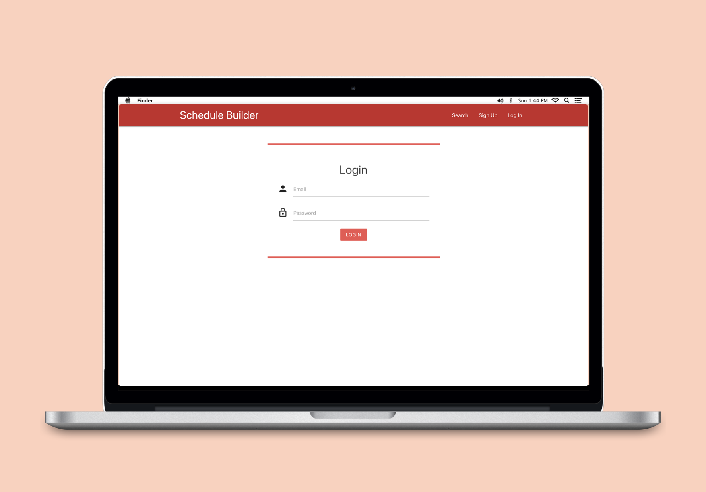
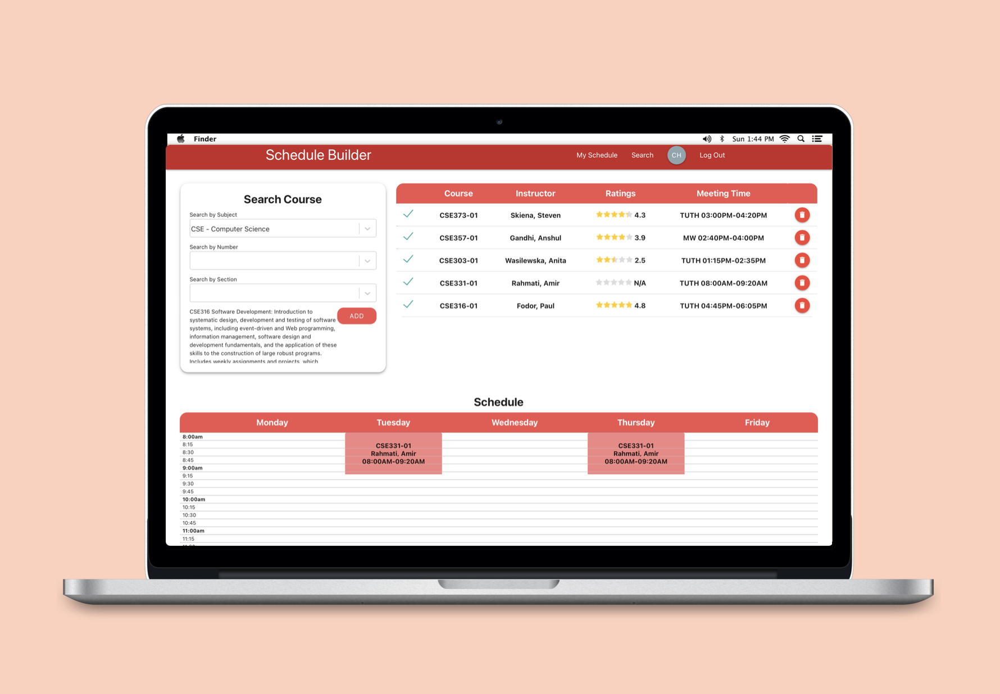

# Schedule Builder
Web application designed to aid in the course selection process by allowing students to build a schedule with the added feature of viewing professor ratings. Professors can really make or break a class experience as not all professors are created equal. For that reason, we have designed this nifty feature as something to keep in mind when selecting courses. We have scraped RateMyProfessor for all 2800+ professor ratings and ClassFind for 6000+ undergrad courses per semester and stored them into our Firebase backend.


## Technologies
Frontend:
* React
* Javascript
* HTML
* CSS
* Materialize

Backend:
* Redux
* Firebase
* Python (Selenium + Beautiful Soup)

## Setup
To run this project, install it locally using npm:
```
$ cd schedule-builder
$ npm install
$ npm start
```

<p align="center">

 
</p>

